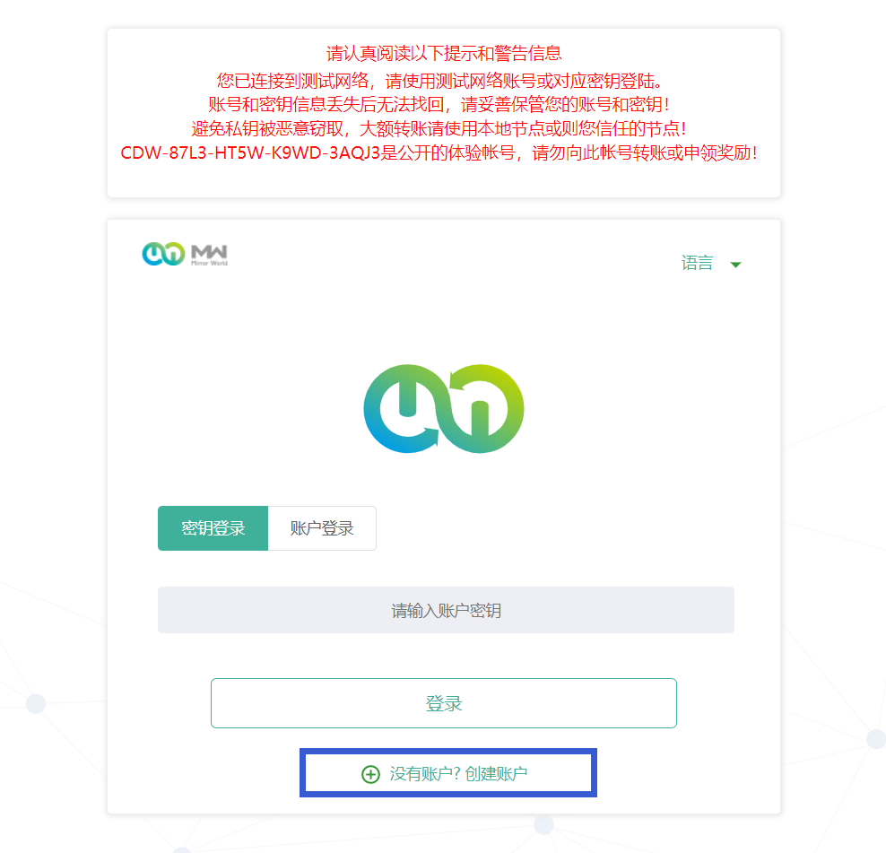
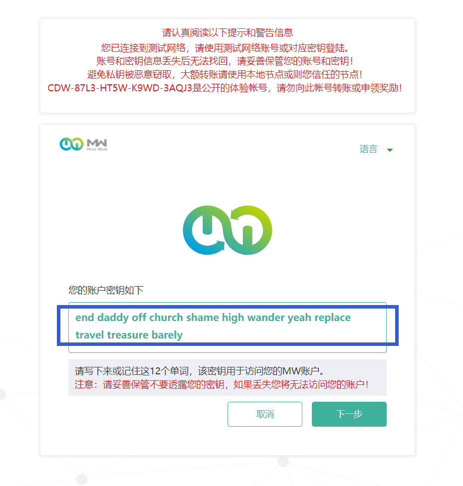
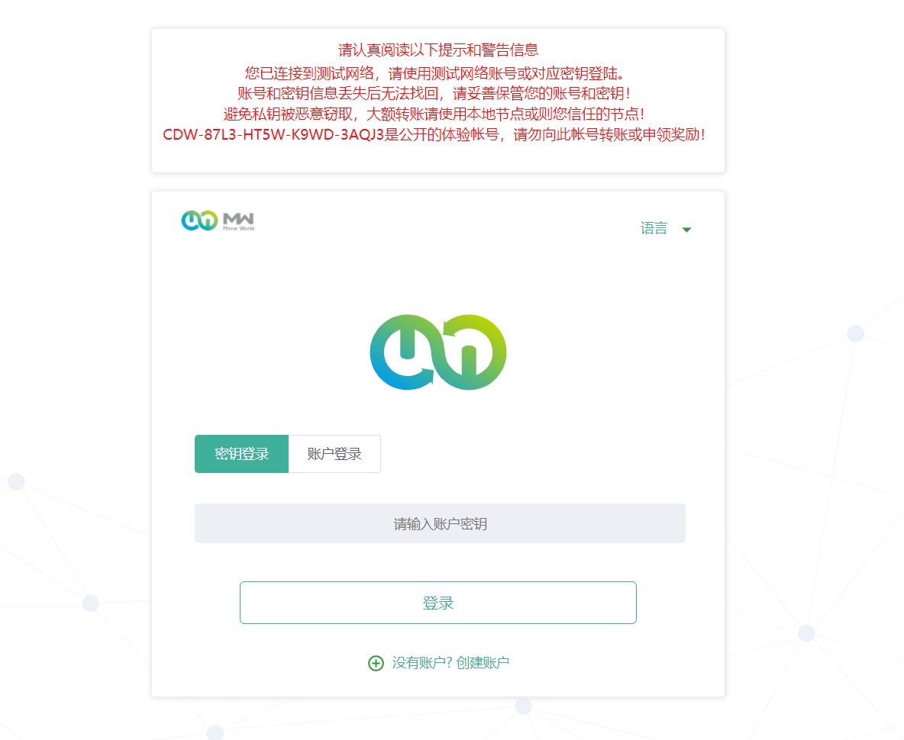
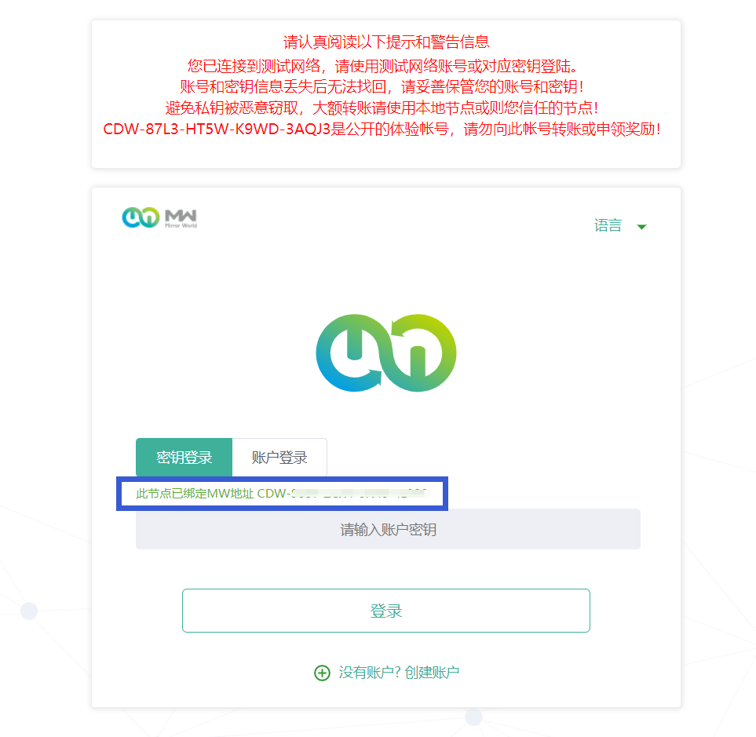

# 挖矿指南
> 许可链版本，也称联盟链

## 1. 创建MW地址
1. 浏览器地址栏输入网址：https://testboot.mw.run/login (或点击 [MW官方节点](https://testboot.mw.run/login) )，选择创建账户：
   
2. 保存MW地址密钥并进入下一步：
   
   ……

## 2. MW挖矿程序安装
1. 登录Linux（Ubuntu）系统，切换至root用户：
```
#命令如下两种都可 
sudo su 
- su root
```
2. 保持在root目录，执行下载安装脚本：
```dotnetcli
wget http://mwfs.oss-cn-shenzhen.aliyuncs.com/cos/client/hub/hub_install_cos.sh
```
3. 为安装脚本赋予执行权限：
```dotnetcli
chmod 667 hub_install_cos.sh
```
4. 执行安装脚本，开始安装MW矿机程序：
```dotnetcli
./hub_install_cos.sh
```
5. 出现如下打印则安装成功（安装完成后需重启一次，正常会自动重启一次，若长时间重启不成功需手动操作一次，确保设备重启完成）：
```dotnetcli
[ OK ] installation is finished 
delete un-necessary files to clean the project... 
[ TIP ] you can manually input command 'reboot' to restart or run /root/mwfs/start.sh to start the MW now! 

clean un-necessary files and folders after the cos installation is successful ... 
clean un-necessary files after the cos installation is successful ... 
[ OK ] Client-1000 COS be installed and reboot the machine now! 

Rebooting...

The generated mining machine code is: xxx
```
> 手动重启指令：`cd ~/mwfs && ./start.sh`

6. 复制上述日志底部打印的`mining machine code`(以下称“矿机编码”): xxx， **注**：`mining machine code`是重要的矿机凭证，后续激活矿机认证需用到该code，**请务必妥善保管**
7. 安装完成后查找端口是否启动：`lsof -i tcp:7216`，当端口启动则安装启动正常，类似如下：
```dotnetcli
root@mwfs-0001:~# lsof -i tcp:7216 COMMAND PID USER FD TYPE DEVICE SIZE/OFF NODE NAME 
java 31942 root 80u IPv6 144909 0t0 TCP *:7216 (LISTEN) 
java 31942 root 82u IPv6 146286 0t0 TCP mwfs-0001:7216->_gateway:50554 (ESTABLISHED) 
java 31942 root 95u IPv6 144912 0t0 TCP mwfs-0001:7216->_gateway:50553 (ESTABLISHED) 
java 31942 root 108u IPv6 146287 0t0 TCP mwfs-0001:7216->_gateway:50561 (ESTABLISHED) 
java 31942 root 110u IPv6 146288 0t0 TCP mwfs-0001:7216->_gateway:50555 (ESTABLISHED) 
java 31942 root 111u IPv6 144046 0t0 TCP mwfs-0001:7216->_gateway:50562 (ESTABLISHED) 
java 31942 root 112u IPv6 144047 0t0 TCP mwfs-0001:7216->_gateway:50558 (ESTABLISHED)
```
8. 访问 http://ip:7216 <IP为矿机IP地址> 访问，检查能够正常能打开 MW矿机客户端 UI 界面:
   

## 3. 矿机认证激活
1. 使用之前注册的MW密钥登录，登录成功后点击**初始化**按钮，进入矿机认证激活环节；
2. 输入所需的信息，并开启**快捷授权**：
    - MW官网账户：若无请开启MW官网账户注册；
    - MW官网密码；
    - 快捷授权：授权程序自动对矿机进行认证激活（未勾选则无法激活）；
    - 矿机编码：用于认证&激活节点的关键参数；
    - 绑定密钥：MW地址密钥；
    - 节点管理密码：后续设备解绑等重要操作时需要验证，注意保存好**节点管理密码**；
3. 点击**确认重启**，等待重启完成后重新登录 http://ip:7216/ <IP为矿机IP地址>，打开地址UI会显示**此节点已绑定MW地址 CDW-……**:
  
4. 输入**MW地址密钥**登录矿机终端UI，等待认证激活（激活成功体现为MW网络上的区块确认）；
5. ……